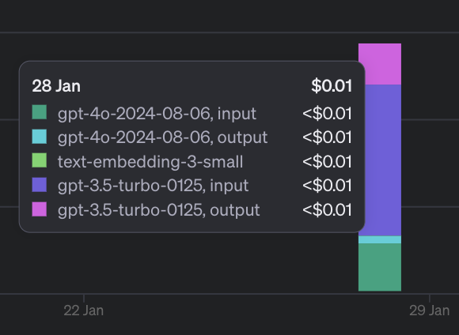

# 初めてのブロードリスニングガイド

このドキュメントは、初めてブロードリスニングに挑戦する人を想定したガイドです。

## 概要

このツール(*)は、コメントのCSVファイルを入力として受け取り、以下のようなHTMLレポートを生成するAIパイプラインです。

- 元のコメントから主要な議論を抽出
- 意味的な類似性に基づいて議論をクラスター化
- 各クラスターにラベルと要約を生成
- 各クラスター内の議論を探索するためのインタラクティブなマップを提供

(* 「このツール」はAI Objective Instituteが開発したTalk to the Cityから派生したものですが、Talk to the Cityにも2種類あり、またかなり大々的に書き換えているため、近々分かりやすい名前をつける予定です)

## 必要なもの

- OpenAIのAPIキー


## Windowsユーザ向けDockerセットアップ

WindowsユーザはMacやLinuxと比較して環境構築で迷いやすいです。Dockerを使用して比較的マシに環境をセットアップできます。
[Windowsユーザ向けDockerセットアップ](for_windows_user.md)を参照。

## その他の環境でのセットアップ

### **Python環境のセットアップ**

Python 3.10以上が必要です。Pythonのバージョン管理にはpyenvを使用することをお勧めします。

Python 3.10をインストールし、仮想環境を作成してアクティブ化します。

必要な依存関係をインストールします。

```bash
pyenv install 3.10.15
pyenv local 3.10.15
python -m venv venv
source venv/bin/activate
pip install -r requirements.txt
python -c "import nltk; nltk.download('stopwords')"
```

### **JavaScript依存関係のインストール**
npmを使用してJavaScriptの依存関係をインストールします。

```bash
cd next-app
npm install
```

### **環境変数の設定**
プロジェクトのルートディレクトリで`.env`ファイルを作成します。`.env.example`ファイルをコピーして編集すると良いでしょう。
以下のような内容になります。

```
OPENAI_API_KEY=<your_openai_api_key_here>
```

### **レポートの生成**
サンプルの`example-polis`データを使用して試してみましょう。

```bash
cd pipeline
python main.py configs/example-polis.json
```

このコマンドは、`pipeline/inputs/example-polis.csv`のデータを使用し、`pipeline/outputs/example-polis/report`にレポートを生成します。

### **レポートの表示**

PythonのHTTPサーバーを使用してレポートを表示します。

```bash
cd pipeline/outputs/example-polis/report
python -m http.server 8000
```

ブラウザで`http://localhost:8000`を開きます。

### API費用の確認
OpenAIのUsege画面を見るとかかった費用がわかります。



この処理では1〜2円程度であることがわかります。
